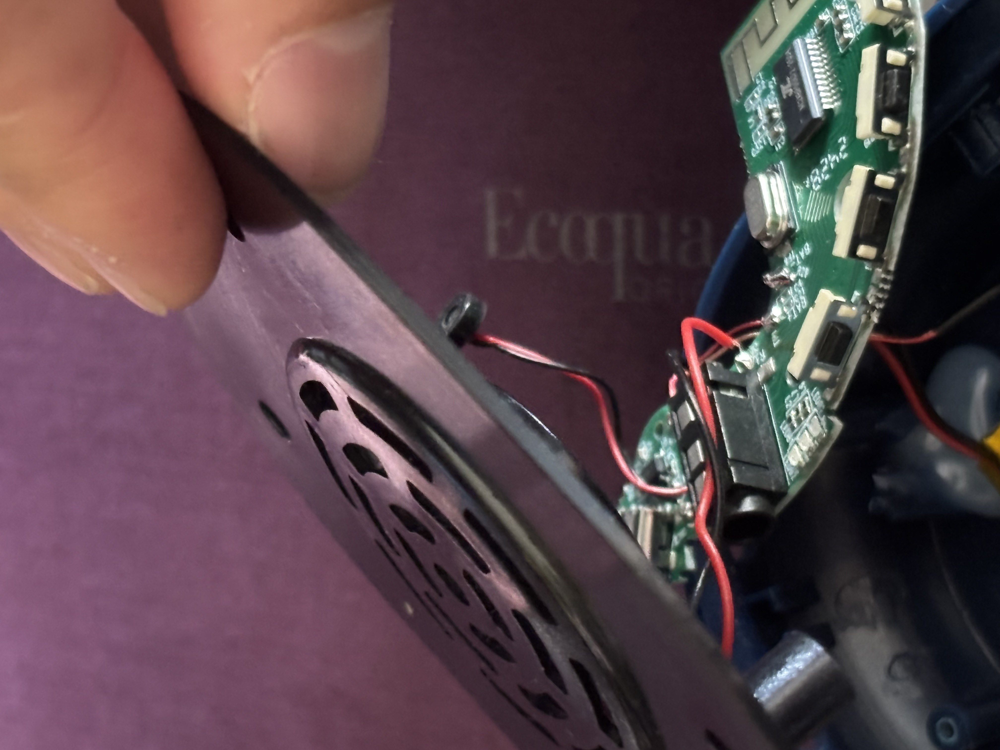
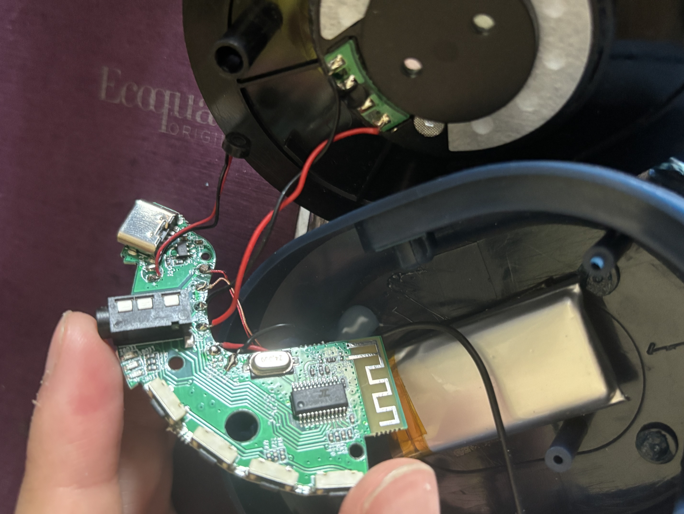

# sesion-04a

## 27 de marzo

Circuit simulator applet es un simulador de circuitos electrónicos se pueden guardar los archivos, modelar en falstad 

### link

<https://www-falstad-com.translate.goog/circuit/?_x_tr_sl=en&_x_tr_tl=es&_x_tr_hl=es&_x_tr_pto=tc>

Si algo mide mil de algo es kilo

Si mide un millón de algo es MEGA

después el Giga tiene 6 ceros  y luego el tera que tiene 12 ceros

el uf que ponemos en la medida de los condensadores electrolítico es microfaradio y el nf que usamos en el condensador cerámico es nanofaradio

## pinout del chip

Pin 1 (GND): Tierra o negativo de la alimentación.

Pin 2 (Trigger/Disparo): Inicia la temporización cuando el voltaje cae por debajo de un tercio del vcc

Pin 3 (Output/Salida): Entrega la señal de salida (alto o bajo), capaz de suministrar hasta 200mA.

Pin 4 (Reset): Reinicia el temporizador. Si se conecta a negativo, el chip se reinicia; debe ir a vcc para funcionamiento normal.

Pin 5 (Control Voltage): Permite modificar los tiempos internos, usualmente conectado a un condensador a tierra para evitar ruido.

Pin 6 (Threshold/Umbral): Detiene la temporización cuando el voltaje supera.

Pin 7 (Discharge/Descarga): Descarga el condensador externo para reiniciar el ciclo de temporización.

Pin 8 : Alimentación positiva (4.5V - 15V)

## ejercicio en clase astable con monoestable

en este ejercicio unimos un circuito astable con un monoestable

al inicio hicimos cada uno por separado, añadiendo parlante y con distintos resultados

https://github.com/user-attachments/assets/86e083c0-6bc7-4727-9de8-ffead0e39b0b

https://github.com/user-attachments/assets/5b5cb009-9445-4e97-b4d4-8eb0e591214b

al inicio no funciono pero teniamo un error que era que no teniamos conectados los protos entre si en la tierra (el positivo de la proto con la otra y el negativo de la proto con la otra), al conectarla obtuvimos este resultado

https://github.com/user-attachments/assets/7160ac8a-d62f-4c3d-a341-d12686352ad5

luego añadimos un potenciometro en el circuito astable que funcionaba para subir y bajar el volumen del sonido, aca este el resultado del astable solo y unido con el monoestable

https://github.com/user-attachments/assets/6e9d8837-71d4-41fa-8182-83874a938a13

https://github.com/user-attachments/assets/a0b89e35-d19b-4ca2-adda-2f31af42bfd0

## encargo-04a

1. destripar un dispositvo electrónico, documentar con texto e imagen el proceso, distinguir los elementos de la PCB que hemos estudiado como R y C y chips.
2. documentar las conexiones entre la PCB y los componentes en la carcasa.
3. escribir un texto de 3 párrafos explicando de forma poética imaginaria el funcionamiento especulativo del dispositivo electrónica, usando metáforas y analogías para describir el flujo de electricidad y la interacción de los componentes. el texto debe ser creativo y evocador, transmitiendo la esencia del dispositivo sin ser técnico, ni tampoco necesariamente real.

### 1.

### Desarme de audífonos Bluetooth

En este caso estoy desarmando unos audífonos Bluetooth que tenía en mi casa. Primero separé el acolchado para facilitar la apertura y luego retiré el parlante de la estructura, lo que dejó visible la PCB.

En la placa pude reconocer varios componentes importantes. Había dos chips, uno con la inscripción LTH7 y otro “C24BP0G672-25D4. Según lo que investigué, el AC24BP se encarga de la conectividad Bluetooth y de la reproducción de sonido, mientras que el LTH7 regula la carga y protege la batería frente a altas temperaturas. También identifiqué la batería, aunque no pude ver su voltaje directamente, aunque según internet, generalmente es de 3.7 V y puede llegar a 4.2 V cuando está completamente cargada.

### Chips

### Bateria

Además, reconocí los botones, que permiten subir y bajar volumen, activar el Bluetooth, pausar, cambiar de canción (manteniéndolos presionados) y encender o apagar. También observé dos tipos de conexiones, una entrada tipo jack para audio y un puerto tipo C para cargar la batería.

### Botones

### Conexiones

Por otro lado, me costó identificar las resistencias y los condensadores, ya que son mucho más pequeños que los que usamos en clase. Al principio pensé que no estaban, pero despues de preguntarle a Aaron, confirmé que sí, solo que son componentes diminutos. También hay dos elementos que no logro reconocer, un óvalo plateado marcado con 24.000 ubicado junto al chip AC24BP, y una pequeña pieza negra conectada mediante cables cerca del puerto tipo C.

### Resistencias

### Condensadores

## 2.

### Uniones y conexiones

Los componentes como los parlantes, la batería y la pequeña pieza negra están conectados a la PCB mediante cables de color rojo y negro.

En cambio, otros elementos como los chips, botones, resistencias, condensadores y conexiones se encuentran directamente ensamblados sobre la placa. A su vez, la PCB está fijada a la carcasa del audífono mediante pequeños tornillos.

## 3.

Dentro de estos audífonos habita un mundo extraño, todo dominado por un gran ente que le otorga energía a todos sus habitantes, esté en algún momento tiene que descansar y recargar energías. Este ente transporta la energía a la gran ciudad donde habitan dos criaturas capaces de cantar e imitar todas la voces y ruidos existentes, pero solo lo hacen cuando les llega energía. Los 4 pilares son los que controlan todo, cada uno tiene distintas funciones como hacer que bajen el volumen la criaturas o activar al ente de la energía.
